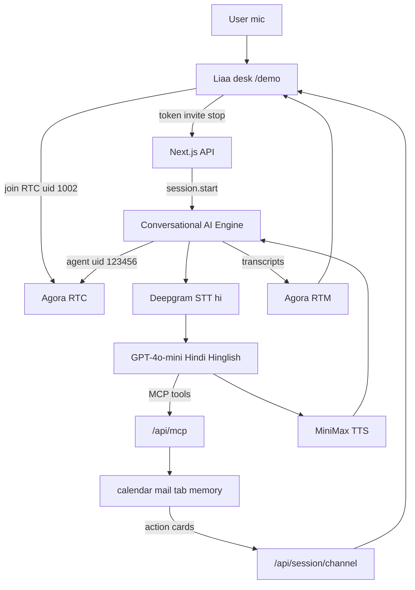

# KrishiSaathi (LIAA) — Architecture & System Details

**Product:** KrishiSaathi / LIAA — Hindi voice agricultural assistant + field CRM  
**Repo:** https://github.com/krabhi75/LIAA  
**Voice layer (mandatory):** Agora Conversational AI Engine  
**Primary demo:** https://liaa-ebon.vercel.app/demo  
**Outbound paths:** [OUTBOUND_PATHS.md](./OUTBOUND_PATHS.md) — Agora Campaign vs CRM Vobiz XML

This document is the source of truth for how the system is built, how voice stays on Agora, and how multi-tool actions surface on the desk.

---

## 1. One-sentence architecture

The browser joins an **Agora RTC** channel; the **Conversational AI Engine** owns STT → LLM → TTS and barge-in; our **Next.js** app only issues tokens, starts/stops the agent, and serves **MCP tools** that Liaa calls to do real work on screen.

---

## 2. High-level diagram

```text
┌──────────────┐     RTC + RTM      ┌─────────────────────────────┐
│  Browser     │◄──────────────────►│  Agora Conversational AI    │
│  /demo desk  │                    │  STT (Deepgram)             │
│  YOU / LIAA  │                    │  LLM (GPT-4o-mini)          │
│  orb · cards │                    │  TTS (MiniMax)              │
└──────┬───────┘                    │  Agent UID 123456           │
       │ HTTP                       └──────────────┬──────────────┘
       │ token / invite / stop / session           │ MCP HTTPS
       ▼                                           ▼
┌──────────────────────────────────────────────────────────────┐
│  Next.js (App Router)                                        │
│  /api/token  /api/invite-agent  /api/stop-conversation       │
│  /api/session/[channel]  /api/mcp                            │
│  lib/tools.ts → calendar · mail · tab · memory (demo store)  │
│  Prisma + SQLite (orgs / agents; desk itself is public)      │
└──────────────────────────────────────────────────────────────┘
```



---

## 3. Why Agora stays central

| Concern | Who owns it |
|---|---|
| Mic capture, playback, channel | Agora RTC SDK in the browser |
| Turn-taking, barge-in | Conversational AI Engine |
| Speech-to-text | Deepgram via Agora (`language: hi`) |
| Reasoning | OpenAI GPT-4o-mini via Agora LLM adapter (Hindi / Hinglish replies) |
| Text-to-speech | MiniMax via Agora TTS adapter |
| Tool calls | MCP server at `PUBLIC_BASE_URL/api/mcp` |
| Tokens / start / stop | Our Next.js routes only |

We intentionally **do not** pipe voice through a custom Groq / OpenAI-compat callback or replace Agora with Twilio / ElevenLabs as the conversation engine. That would break the hackathon voice requirement and add latency.

**ElevenLabs / Google Calendar Gmail** are optional later upgrades (voice quality / real data). They are **not** required for multi-function demos — tools already chain via MCP.

---

## 4. Runtime components

### 4.1 Front end (desk)

| Piece | Path | Role |
|---|---|---|
| Live desk | `components/desk/MolVaaniDesk.tsx` | Start/Stop conversation, transcript, action chains |
| Orb | `components/desk/NovaOrb.tsx` | Listening / speaking / working visual state |
| Styles | `app/nova.css` | Instrument layout (transcript · stage · actions) |
| Call hook | `hooks/useAetherCall.ts` | RTC join, invite agent, RTM transcripts, RTT, session poll |
| Entry | `app/demo/page.tsx` | Public demo (no sign-in) |

**UI behaviour**

- **Start conversation** → mic + `POST /api/invite-agent` + agent joins channel  
- **Stop conversation** → leave + `POST /api/stop-conversation` (ends transcription)  
- **Live transcript** → RTM lines labeled `YOU` / `LIAA`  
- **Linked actions** → tools fired within ~12s grouped into a progress chain (step `1/n`, bar, connectors)

### 4.2 Voice session (invite)

`app/api/invite-agent/route.ts` builds an Agora `Agent` with:

- `turnDetection.language`: `hi-IN`  
- `DeepgramSTT`: model `nova-3`, language `hi`  
- LLM: OpenAI-compatible GPT-4o-mini + system prompt from `buildLiaaSystemPrompt` (speak Hindi / Hinglish)  
- `MiniMaxTTS`: voice id configurable (`LIAA_TTS_VOICE`)  
- MCP servers registered when `PUBLIC_BASE_URL` is a **public HTTPS** URL (not localhost)  
- Greeting from `liaaGreeting()` (Hindi: “नमस्ते। Liaa तैयार है…”)

**Language split:** desk chrome (buttons, labels, status) is **English**; spoken conversation and transcripts are **Hindi / Hinglish**.

### 4.3 Tools (MCP)

| Tool | Effect | Demo honesty |
|---|---|---|
| `get_calendar` | List events in range | DEMO DATA badge |
| `create_event` / `update_event` / `delete_event` | Mutate in-memory/session calendar | DEMO DATA |
| `read_email` / `draft_email` / `send_email` | Inbox / draft / fake send | DEMO DATA |
| `open_tab` | Open trusted hosts; ask for others | Live (browser) |
| `remember` / `get_memory` | Persist facts in `.nova-memory.json` | Live file |

Definitions: `lib/tools.ts` · served by `app/api/mcp/route.ts` · cards recorded via `lib/store.ts` and polled at `app/api/session/[channel]`.

### 4.4 Identity & prompt

| Export | File | Purpose |
|---|---|---|
| `LIAA_INSTRUCTIONS` | `lib/prompt.ts` | Persona: Hindi/Hinglish speech; English desk chrome |
| `buildLiaaSystemPrompt` | `lib/tools.ts` | Per-channel time, site, memory, recent ids |
| `GREETING` / `liaaGreeting` | `lib/prompt.ts` | First spoken line |

Agent display name in DB seed / updates: **Liaa** (`lib/saas.ts`, `lib/auth.ts`).

---

## 5. UIDs & channels

| Role | UID | Notes |
|---|---|---|
| User (desk) | `1002` | `CUSTOMER_UID` in `lib/ids.ts` |
| Liaa (agent) | `123456` | `AGENT_UID` — started by Conversational AI |
| Human join (legacy) | `2002` | `/human` same channel if used |

Each browser tab gets a unique **channel** string (`useClientChannel`) so sessions do not collide.

---

## 6. Request sequence (happy path)

```text
1. User opens /demo → channel id minted
2. Start conversation → getUserMedia
3. POST /api/token → RTC (+ RTM) tokens
4. Client joins Agora RTC, publishes mic
5. POST /api/invite-agent → Agent.createSession().start()
6. Liaa greets in Hindi on the channel
7. User speaks (Hindi/Hinglish) → Deepgram → LLM → optional MCP tool(s) → MiniMax → audio
8. RTM transcripts stream to desk; tool cards appear in Actions
9. Stop conversation → agent stop + leave channel
```

**Multi-tool example:** “What’s on my calendar, and book a sync with Rahul tomorrow at four.”

1. `get_calendar` → card  
2. `create_event` → card  
3. Desk groups them as **Linked actions** with step progress  

---

## 7. Data & persistence

| Store | What | Lifetime |
|---|---|---|
| In-process channel state | Demo calendar / mail for tools | Process memory (reset on server restart) |
| `.nova-memory.json` | `remember` facts | Disk, durable across restarts |
| Prisma SQLite (`DATABASE_URL`) | Orgs, agents, usage (SaaS stubs) | Local file DB |
| Agora | Audio + transcripts in flight | Not stored by us |

Honest UX: seeded calendar/mail show **DEMO DATA** so judges know Meet links are not live Google.

---

## 8. Environment

```bash
NEXT_PUBLIC_AGORA_APP_ID=
NEXT_AGORA_APP_CERTIFICATE=
AGORA_AREA=US
PUBLIC_BASE_URL=https://<cloudflare-tunnel>   # required for tools live
AETHER_MCP_KEY=
DATABASE_URL="file:./dev.db"
AUTH_SECRET=
# optional
LIAA_TTS_VOICE=          # overrides MiniMax voice id
NOVA_TTS_VOICE=          # legacy alias still accepted
```

**MCP rule:** Agora’s cloud must call your tool endpoint. `localhost` → **tools offline**. Run:

```bash
cloudflared tunnel --url http://localhost:3000
```

Put the `https://…trycloudflare.com` URL in `PUBLIC_BASE_URL`, restart `npm run dev`.

---

## 9. Key routes

| Route | Method | Purpose |
|---|---|---|
| `/demo` | GET | Public Liaa desk |
| `/` | GET | Landing |
| `/api/token` | POST | RTC/RTM tokens |
| `/api/invite-agent` | POST | Start Conversational AI session |
| `/api/stop-conversation` | POST | Stop agent |
| `/api/session/[channel]` | GET | Tools + cards for UI |
| `/api/mcp` | POST | MCP tool server for Agora |
| `/api/health` | GET | Liveness |

Auth/console routes under `/app/*` redirect or stub toward the public desk for this demo build.

---

## 10. Tech stack

| Layer | Choice |
|---|---|
| Framework | Next.js 16 (App Router) + TypeScript |
| Voice | `agora-agents`, `agora-rtc-sdk-ng`, `agora-rtm-sdk`, client toolkit |
| STT / LLM / TTS | Deepgram nova-3 · GPT-4o-mini · MiniMax speech-2.6-turbo (via Agora) |
| Tools | MCP over HTTPS |
| DB | Prisma + SQLite |
| UI | Custom instrument CSS (`nova.css` class prefix retained) |

---

## 11. Design decisions & tradeoffs

| Decision | Why | Tradeoff |
|---|---|---|
| Agora-managed models only | Meets track rules; less glue | Less TTS voice shopping |
| Demo calendar/mail | Fast, reliable for judging | Not production Google |
| Public `/demo` without login | Frictionless live demo | No multi-tenant auth on the desk |
| Cloudflare tunnel for MCP | Agora cloud → tools | Tunnel URL changes when restarted |
| English UI + Hindi/Hinglish voice | Clear chrome for judges; natural conversation for Bharat demos | Transcript may mix scripts |
| Linked action chains in UI | Shows multi-function clearly | Grouping is time-window heuristic (~12s) |

---

## 12. Known limits

1. Without a fresh `PUBLIC_BASE_URL`, the bar shows **tools offline** — voice may still work; tools will not.  
2. Calendar/mail mutations are demo-backed until Google OAuth is added.  
3. Serverless hosts reset in-memory tool state; local `next dev` is the reliable demo path.  
4. Mic requires HTTPS or localhost; LAN HTTP often blocks getUserMedia.

---

## 13. Local runbook

```bash
npm install
npm run db:push
npm run db:seed
npm run dev
# separate terminal:
cloudflared tunnel --url http://localhost:3000
# paste HTTPS URL into .env.local PUBLIC_BASE_URL, restart next
```

Open **http://localhost:3000/demo** → **Start conversation** → allow mic → speak Hindi or Hinglish.

Suggested spoken beats:

1. “आज का दिन कैसा दिखता है?” / “What does my day look like?”  
2. “Rahul से कल चार बजे meeting book करो.”  
3. “Inbox में क्या है?” / “Remember my name is …”  

---

## 14. Related docs

| Doc | Contents |
|---|---|
| [README.md](../README.md) | Quick start + feature table |
| [DEMO.md](./DEMO.md) | Live / video shot list |
| [SUBMISSION.md](./SUBMISSION.md) | Contest paste copy (update if track form differs) |

---

*Last updated for agent identity **Liaa**, English desk chrome, Hindi/Hinglish conversation, and Agora-central tool architecture.*
